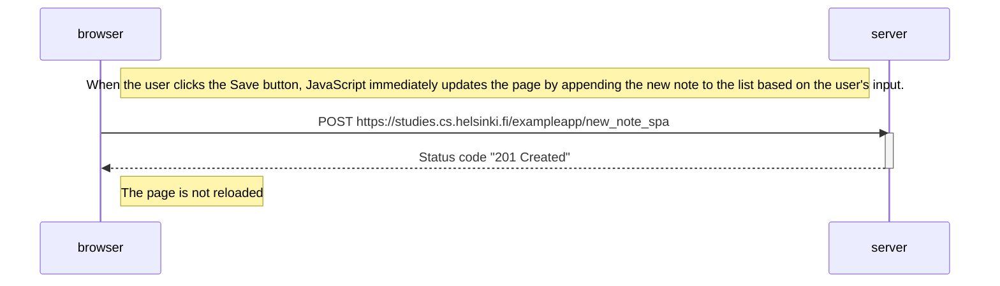

```mermaid
sequenceDiagram
    participant browser
    participant server

    Note right of browser: When the user clicks the Save button, JavaScript immediately updates the page by appending the new note to the list based on the user's input.

    browser->>server: POST https://studies.cs.helsinki.fi/exampleapp/new_note_spa
    activate server
    server-->>browser: Status code "201 Created"
    deactivate server

    Note right of browser: The page is not reloaded
```
